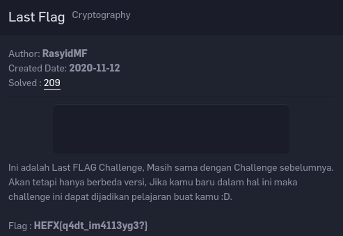
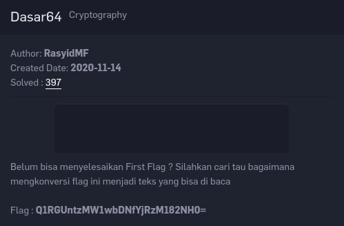
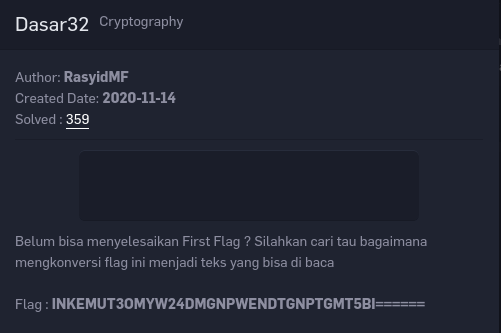

# First Flag
Points: 200

# Category
Cryptography

# Hint
> Semua Challenge ada Hint yang akan membantu kalian untuk menyelesaikan challenge, dan pastinya Hint harus dibayar menggunakan point skor kalian. Dan untuk First Flag ini gratis, Kalian hanya konversi angka tersebut menjadi deadbeef, Kemudian hasil nya di konversi lagi dan lagi sampai mendapatkan flag!

# Penyelesaian

Di challenge ini sangat mudah,kalian tinggal ke halaman home [rasyidmf](https://rasyidmf.com/).

nah ketemu tuh deretan angka-angka acaknya,udah ada hintnya juga sih di challenge ini,kalian tinggal search tuh *decoder deadbeef* atau pake decoder [*deadbeef.app*](https://deadbeef.app).

masukkan angka-angka tersebut ke inputan desimal,kemudian copy output hexadesimal.
decode lagi hexadecimal ke ascii menggunakan tools [*hex to ascii*](https://www.rapidtables.com/convert/number/hex-to-ascii.html).

keluar tuh outputnya,dengan format *base32 encode*,tinggal decode lagi deh [*base32 decoder*](https://emn178.github.io/online-tools/base32_decode.html).  

keluar lagi outputnya sekarang formatnya *base64*,decode lagi dah [*base64 decoder*](https://emn178.github.io/online-tools/base64_decode.html).

ketemu deh flagnya.
> *Flag :  CTFR{th1s_1s_your_f1rst_fl4g}*
---

# SECOND FLAG
Points : 100

# Category
Cryptography

# Hint
> *Caesar Cipher*

# Penyelesaian

Di challenge ini cuma mendecode character yang tergeser.  
toolsnya? [*ini.*](https://www.dcode.fr/caesar-cipher)

> Flag : CTFR{s3c0nd_fl4g_w4s_c1ph3r_t3xt}
 
---

# Last Flag
Points : 400

# Category
Cryptography

# Hint
> *Ini adalah Last **FLAG** Challenge*
# Penyelesaian

Di challenge ini cuman mendecode flagnya dengan vigenere cipher.  
- *Tools : [sini](https://www.dcode.fr/vigenere-cipher)*  
- *Key : FLAG*  

> *Flag : CTFR{l4st_ch4113ng3?}*

---

# Dasar64
Points : 50

# Category
Cryptography

# Hint
> *dijudulnya*

# Penyelesaian

Seperti yang tertulis dideskripsi challenge,bagi kalian yang belum bisa nyelesain first flag kalian tinggal mendecode flag dichallenge ini menggunakan tools online [*Base64 decoder*](https://gchq.github.io/CyberChef/#recipe=From_Base64('A-Za-z0-9%2B/%3D',true)).  
\
\
> *Flag : CTFR{s1mpl3_b4s3_64}*
---

# Dasar32
Points : 50

# Category
Cryptography

# Hint
> *toolsnya sama ama challenge dasar64 bedanya cuman di 64 nya*

# Penyelesaian

Toolsnya sama ama yang di challenge *Dasar64* bedanya cuman di angkanya.  
decodernya :

