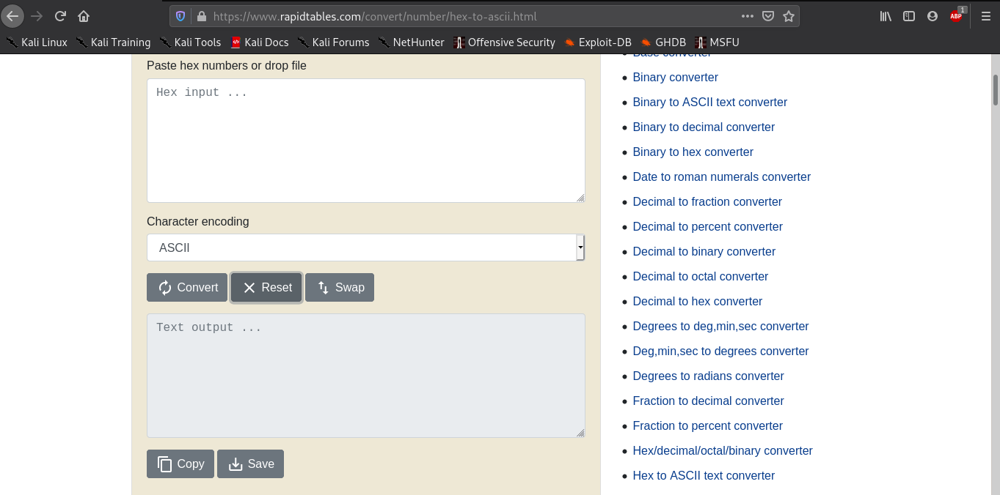

# First Flag
Points: 200

# Category
Cryptography

# Hint
> Semua Challenge ada Hint yang akan membantu kalian untuk menyelesaikan challenge, dan pastinya Hint harus dibayar menggunakan point skor kalian. Dan untuk First Flag ini gratis, Kalian hanya konversi angka tersebut menjadi deadbeef, Kemudian hasil nya di konversi lagi dan lagi sampai mendapatkan flag!

# Solution

Di challenge ini sangat mudah,kalian tinggal ke halaman home [rasyidmf](https://rasyidmf.com/).

nah ketemu tuh deretan angka-angka acaknya,udah ada hintnya juga sih di challenge ini,kalian tinggal search tuh *decoder deadbeef* atau pake decoder [*deadbeef.app*](https://deadbeef.app).

masukkan angka-angka tersebut ke inputan desimal,kemudian copy output hexadesimal.
decode lagi hexadecimal ke ascii menggunakan tools [*hex to ascii*](https://www.rapidtables.com/convert/number/hex-to-ascii.html).

keluar tuh outputnya,dengan format *base32 encode*,tinggal decode lagi deh [*base32 decoder*](https://emn178.github.io/online-tools/base32_decode.html)  

keluar lagi outputnya sekarang formatnya *base64*,decode lagi dah [*decoder*](https://emn178.github.io/online-tools/base64_decode.html).

and BOOM!! ketemu flagnya.
> *FLAG :  CTFR{th1s_1s_your_f1rst_fl4g}*

